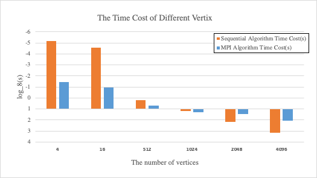
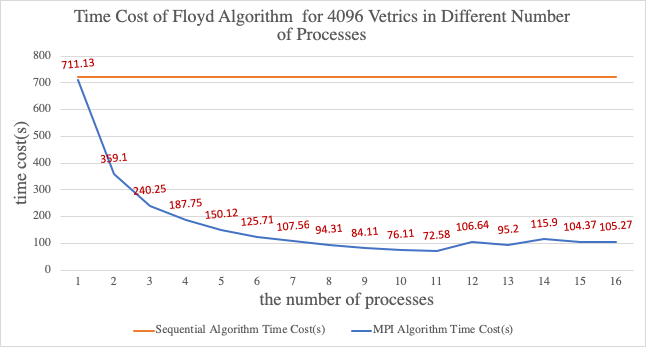
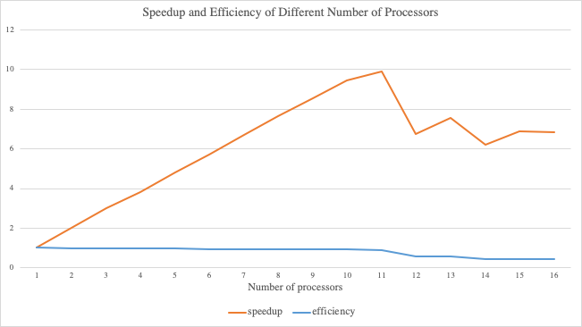

# Floyd_MPI

<!-- TOC -->

- [Introduction](#introduction)
- [Floyd-Warshall algorithm:](#floyd-warshall-algorithm)
- [Parallel Algorithm](#parallel-algorithm)
    - [Distributed Parallelism](#distributed-parallelism)
    - [the Parallelization of Floyd Algorithm](#the-parallelization-of-floyd-algorithm)
- [Data Analysis](#data-analysis)
- [Reference](#reference)

<!-- /TOC -->


## Introduction

***
<font face="Times new" size=4 align="justify">
In this assignment, the goal is to design and implement parallel algorithm to solve the all pairs shortest path problem for a number of large graphs. We have decided to use Floyd-Warshall as Dijkstra’s algorithm finds the shortest path between a single pair of vertices. However, Floyd-Warshall finds the shortest paths between all pairs of vertices, so we decided to use Floyd-Warshall to parallel the program.
</font>

## Floyd-Warshall algorithm:

***
<font face="Times new" size=4 align="justify">

Floyd-Warshall is a famous algorithm to solve the Shortest Paths (All Paris Shortest Paths between any two vertices). In general, Floyd algorithm is a very elegant triple 'for' loops, and the inside statement is also very simple. Floyd algorithm is a “Dynamic Programming algorithm” that makes it so exquisite.  In dynamic programming algorithm, one of the core concepts is the definition of state. In this case, we can regard it as $d^k_{ij}$. Assuming we have N vertices grouph, for arbitrary vertex $i,j,k$ belongs to 1,2,..,N the $d^k_{ij}$ is defined as:

$min\{d(i,n)+d(n,j)| n\in [1,k]\}$ where the d(.) function likes the distance function defined in metric space but do not suifficient the triangle inequality.

With the definition of state, the dynamic transition equation can be constructed according to the idea of dynamic programming.The basic idea of dynamic transition is to establish a transition map of a state and a previous state[1]. According to the previous definition, $d^k_{ij}$ is a state using node 1 to node k, and we can find a way to transfer this state dynamically to the state using node 1 to (k-1), namely, $\displaystyle{d^{k-1}_{ij}}$. For $d^k_{ij}$, there are two situations: (1) the shortest path from i to j does not pass through k which means $d^{k}_{ij}$=$d^{k-1}_{ij}$ without the shortest path through the node k; (2) The shortest path from i to j goes through k represented as $d^{k}_{ij}=d^{k-1}_{ik}+d^{k-1}_{kj}$. 

Therefore, the dynamic transfer equation of Floyd algorithm can be obtained by integrating the above two situations. After iteration ${N*N*N}$ times, $d^{N}_{NN}$ will be the shortest path length between all the nodes in the matrix.

As the pseudocode shown below:

$\mathrm {For}\  k\ \mathrm{in}\ 1\ \mathrm{to}\ N$

$\ \ \ \ \mathrm {For}\  i\ \mathrm{in}\ 1\ \mathrm{to}\ N$

$\ \ \ \ \ \ \ \ \mathrm {For}\  j\ \mathrm{in}\ 1\ \mathrm{to}\ N$

$\ \ \ \ \ \ \ \ \ \ \ \ \ d^k_{ij}=min\{d^{k-1}_{ij},d^{k-1}_{ik}+d^{k-1}_{kj}\}$

$\mathrm{return}\ d^{N}_{NN}$

Obviously, the time complexity is $O(n^3)$. After using triple loops for Floyd-Warshall algorithm, the distance between any two vertices is the shortest. Given a simple rigorous proof for the mathematical induction, assuming that if the k is less than or equal to n, the Floyd algorithm is correct, and to prove k is equal to n+1, the Floyd algorithm is still true. Let k = n+1 be the last point.

(1) If the shortest distance between any two vertices does not pass through k nodes, Floyd algorithm is obviously valid.

(2) For arbitrary vertex i,j belongs to 1..N. if it goes through k then

 $min\{d(i,n)+d(n,j)| n\in [1,k]\}$

 $= min\{d(i,n_1)+d(n_1,k)+d(k,n_2)+d(n_2,j)| n_1,n_2\in [1,k-1]\}$

 $=min\{d(i,n)+d(n,k)| n\in [1,k-1]\}+min\{d(k,n)+d(n,j)| n\in [1,k-1]\}$.

 Therefore, the $d[k][i][j]=d[k-1][i][k]+d[k-1][k][j]$.

It is noticed that the diagonal of the matrix contains only zeros. Therefore, firstly, we should initialize the matrix and then check if (i==j) which means all the diagonal in this matrix should be ignore. Besides, if the weight of edge between i and j is 0, then there is no path between these two vertices.  
</font>

## Parallel Algorithm

***

### Distributed Parallelism


<font face="Times new" size=4 align="justify">

We designed this parallel algorithm based on the Folyd algorithm. In the design of parallel algorithm, the decomposition of the problem usually has two forms: one is to decompose the space of problems into several smaller problem areas and then solved separately; The other is to decompose a big problem into several sub-problems according to the function, and then each sub-problem is solved in parallel.[2] For the shortest path problem between all point pairs, it is more convenient to choose the former after we adopting Floyd algorithm. In this case,  the strategy we used is to separate a huge matrix to several smaller matrices by their rows and allocating these smaller matrices for every process (or node). Like follow:

$$\displaystyle{
\left[
\begin{matrix}
& rank0 &          \\ \\\hline
 & rank1 &\\
  \\\hline 
  & rank2 &\\ \\\hline&\cdots&    
\end{matrix}
\right]}
$$

We will demonstrate the correctness of this method later. By the way, the reason why we do not use column to split the matrix is that column data structure is not contiguous. Therefore, a new MPI datatype might need be applied to calculate it which is both expensive and troublesome.

In order to allocate the number of values from matrix evenly to every process, we defined an int type array called offset_of_slice[size+1], this array will record the start offset and end offset of matrix row for every process. The following codes show how to allocate the start offset and end offset. In general, the number of rows distributed for each process is $\lfloor \frac{vertex\ number}{the\ number\ of\ process}\rfloor$. However, if the rank of a process is smaller or equal to the reminder of above formula, then allocate one more into this rank. The advantage of this method is to assign rank scope evenly instead of adding all of the remainder to the end of the rank.

```c
for (int i = 1; i <= size; i++)
        {
            if (i <= PGrph->vexnum % size)
                offset_of_slice[i]=vexnum / size+offset_of_slice[i-1]+1;
            else
                offset_of_slice[i]=vexnum / size+offset_of_slice[i-1];
        }
```

 In order to illustrate how the offset works,assuming we have got $16\times16$ matrix and total processes is 6. Obviously, the reminder will equal to $16mod6=4$. The first process always start at 0 which indicates offset_of_slice[0] = 0. The second one offset_of_slice[1] = $16 / 6 + 0 + 1 = 3$, because rank 1 is smaller than remainder. However, when the index greater than 4, the offset will be add the quotient directlly,like offset_of_slice[5] = 12 + 2 = 14.

Rank|offset[Rank]|scope
--|:--|:--|:--
0|0|[0:3)
1|3|[3:6)
2|6|[6:9)
3|9|[9:12)
4|12|[12:14)
5|14|[14:16)
offset[6] (size+1)|16|Null
\*Noticed that the offset[6] indicates the end offset of process 5, but not the rank of process.


After allocate start offset and end offset to each process, MPI_Bcast function was used to broadcast the corresponding rows for every process, as well as the number of vertices. Two matrices were created subsequently. One called distance which is going to store the matrix of distance and another one called distance_new to output the new matrix. These two matrix are crucial for following Floyd-Warshall algorithm's calculation.
</font>

### the Parallelization of Floyd Algorithm 

<font face="Times new" size=4 align="justify">

 As we mentioned above, we adopt the strategy that split the second layer ‘for’ loop(rows) to achieve the parallelize Floyd algorithm. However, there are some problems in this method.

Firstly, according to Floyd algorithm, the shorter distance’s judgment conditions is $ d^{k-1}_{ik}+ d^{k-1}_{kj} < d^{k-1}_{ij} $. Obviously, the $ d^{k-1}_{ik}, d^{k-1}_{ij} $ are both stored in $i$th row, whose optimized information is in the current process while $d^{k-1}_{kj}$'s is not. The rank which stored $d^{k-1}_{kj}$ depends on the iterate variable $k$, so it is highly possible that the optimized $d^{k-1}_{kj}$ is not in current process.  In order to solve this problem, I’ve come up with a lot of ways. For example, using the send and recv function, but it will cause the dead lock. isend and irecv is worked, but quite hard to management. After I read some relative resources, I am aware of that the best way to solve the problem is to find which process contain kth row (called K_root), and then use MPI_Bcast function to broadcast from k_root to every process.[2]

For example, in the case we mentioned before (the 16*16 matrix one), assuming the process’s rank is 1and the testing distance is $d(3,15)$, which belongs to process one. Then we want to ensure if $d(3,9)∈1+ d(9,15)∈3$ is shorter than the original $d(3,15)$. As I mentioned above, the $d(9,15)$ is not in process 1, but process 3. Hence, we cannot test it directly. However, if we send the 9th row from process 3 to process 1 at first, then the optimized distance in that row will be obtained, so that this test would be valid. In general case, every process will do such kind of operation. Therefore, the 9th row should be sent repeatedly. Send and receive same information again and again is nether wised nor practicable. After first ‘for’ loop (the intercept point is the index), we can use the MPI_Bcast function directly to realize it.

Another problem is how we gather every process’s independent information. There are several practicable ways can be applied. One of them is using gather function. This way is intuition and explicit. However, from the method of row’s allocation we adopt, the distance matrix segmentation’s size of each process is different. Therefore, we need to create two different communication groups to represent two different size of segmentation. Meanwhile, in our design, each process’s segmentation is not stored in the same place (Actually, they are stored in the different places of same matrix), which means that it needs to constantly allocate new spaces as buffer to transfer information. Hence, although using gather function is doable and straightforward, I still adopt another way.

The other way I come up with is using reduction function. The output we want actually is the shortest distance of whole graph. Therefore, for arbitrary element in the output distance matrix, it must be the minimum comparing to other elements at same place of all process’s distance matrix. That is why the reduction function works. The realization of this method is quite simple, which is just adding an MPI_reduction clause in the end of Floyd algorithm. it is noticed that the reduction operation we used is not the build-in minimum operations, because the disconnection is regarded as 0. If we apply it, then the disconnection will be always regard as the shortest distance. That is why we have defined our own function called minmum_distance. What Minimum_distance op does is almost like the build-in minimum operation except ignoring the zero-element.

However, it still has some defects. In fact, the second method is more expensive than the former mothed, because it need to do logic calculation. Besides, every time doing reduction, it needs using the whole distance matrix from different process to compare, which is worthless. Because, we know the really useful information in each process is just a segmentation but not the whole distance matrix. That problem can be deal with elegantly, we can design a special MPI datatype by ourselves to tell reduction function which elements need to be compare, which need not.
</font>

## Data Analysis

<font face="Times new" size=4 align="justify">

We compared the normal Floyd algorithm with the algorithm we wrote. The improvement is quite significant. The adjacent matrix’s size is increasing exponentially, so the execution time have a huge difference. To represent the information clearly, we did some transformation for original data. The y axis indicated the $log_8(time)$ in reversed, which is because Floyd algorithm’s time complexity is $O(n^3)$, and the base of exponential increase of the adjacent matrix’s size is 2). The figure is showed in below.

<div align="center">



</div>

From the figure, we can observe that the sequential algorithm was faster than the parallel one when the vertex number are small. That is make sense, because the initialization, finalization and communication of MPI need to consuming resource. However, when the number of   vertices become bigger, the advantage of parallelism will be performed. For example, in the 4096 vertices case, the parallel algorithm are 10 times faster than the sequential one (we used 11 processors to test running it).

The following graph represents the time consuming of the 4096 vertices in different processors number. 

<div align="center">



</div>

Before we analysis it, it is necessary to recommend the measure we used[3]:

<div align="center">

$ \mathrm {speedup}: \Phi(n,p) = \frac{sequential\ execution\ time}{parallel\ execution\ time}$

$ \mathrm {Eiffciency}:\epsilon(n,p)=(\frac{sequential\ execution\ time}{processors\ used\times parallel\ execution\ time}) $

</div>

<div align="center">


</div>

This result is quite ideal. when the processors number is smaller than 11, the efficiency is quite closed to 1, which means that there is no much extra cost of MPI algorithm. Furthermore, after a period of constant increase, the speedup achieved the peak at processor 11, which means this algorithm is work well. However, after that, the curve is fluctuant, and we also tested several times the trend still the same. In fact, the nodes we used to computing has 12 processors, but using 12 processes is much slower than 11 processes and 13 processes. Although we have done lots of research about that, this kind of problem still cannot be solved. To figure out the reason of this problem, we may need further research.

</font>

## Reference

<font face="Times new" size=4 align="justify">

[1] *<a href="https://www.cnblogs.com/chenying99/p/3932877.html">Explore the essence of dynamic programming of Floyd algorithm</a>*
[2] *<a href="https://blog.csdn.net/mmayanshuo/article/details/72870262">Floyd shortest path algorithm for MPI</a>*
[3] *<a href="https://www3.nd.edu/~zxu2/acms60212-40212/Lec-06.pdf">Performance Analysis</a>*


</font>
